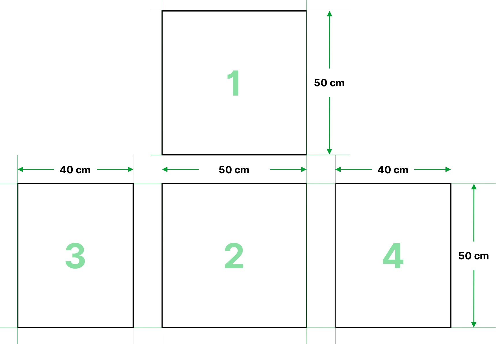
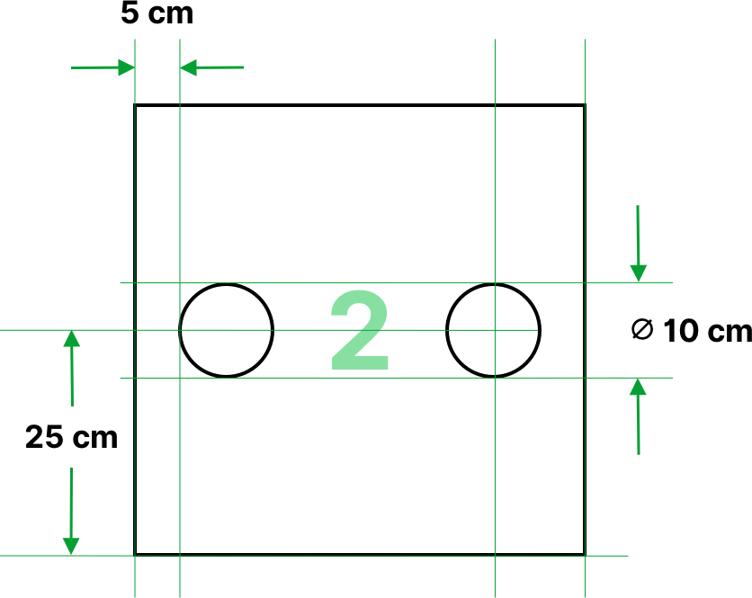
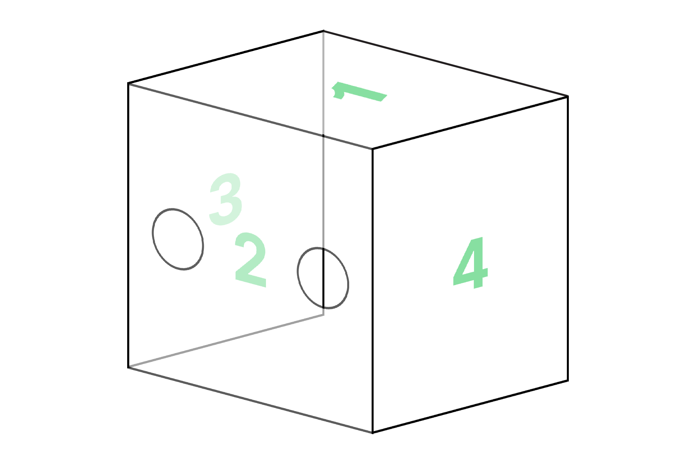

# Caja para intubación de acrílico

<section class="materials">

## Materiales

- Hojas de acrílico, u
- Hojas de policarbonato transparente  
- Pegamento acrílico

</section>

<section class="tools">

## Herramientas

- Cortador de acrílico

</section>

## Procedimiento

1. Cortar 4 piezas de acrílico con los siguientes tamaños:

  - **2 piezas** de **40 x 50 cm**
  - **2 piezas** de **50 x 50 cm**

2. En una de las piezas de **50 x 50 cm** (número dos en el diagrama de arriba), realizar dos agujeros para que el médico o enfermera introduzca las manos de acuerdo al siguiente diagrama:

3. Pegar las piezas de la siguiente forma:

