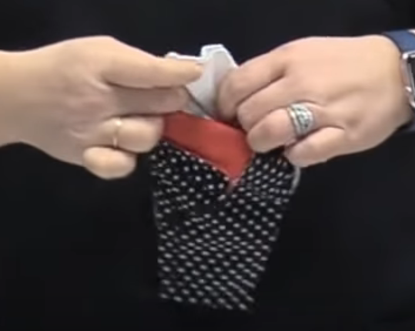

# Máscara cubrebocas tipo Olson

Esta máscara es para utilizarse como alternativa (no como reemplazo) a los cubrebocas quirúrgicos, en caso de que estos sean escasos. Lavable y reutilizable. Este tutorial utiliza diferentes telas para mostrar de mejor forma la construcción de la máscara.

Duración del procedimiento: 15 - 20 minutos.

## Materiales

- Tela de algodón
- Hilo
- Ligas para el cabello
- Cinta adhesiva doble cara
- Filtro de o.3 micras

## Herramientas

- Máquina de coser (o aguja para coser)
- Tijeras
- Alfileres (opcional)

## Procedimineto

### Componente
Para la creación de los componentes, se debe recortar la tela acorde a los modelos de las piezas (los archivos de los modelos los puedes encontrar al final del artículo).

#### Primer paso

Esta pieza es la que va a cubrir el área de la boca por dentro de la máscara.

- Hacer un doblez de ½ cm aprox. del lado 5 en la pieza mouth 1 y coser.

- Repetir el paso 1 para la pieza mouth 2.
- Coser las piezas mouth 1 y mouth 2 por el lado 3. Puedes usar alfileres para sujetar ambas piezas juntas mientras se cosen.

#### Segundo paso

Estas piezas son las que van a cubrir el área de las mejillas por dentro de la máscara.

- Hacer un doblez de ½ cm aprox. del lado 6 en la pieza cheek 1 y coser.

- Repetir el paso 1 para la pieza cheek 2.

#### Tercer paso

Esta pieza es la que va a cubrir a la máscara por el lado de afuera.

- Coser las piezas face 1 y face 2 por el lado 3.

### Ensamblaje

- Colocar la pieza cheek 1 sobre la pieza mouth 1 hasta la línea punteada (7). Puedes utilizar alfileres para sujetar ambas piezas juntas.

- Coser los lados 1 de ambas piezas en el espacio donde se superponen, y repetir para los lados 2.

- Repetir el paso 1 y 2 para las piezas cheek 2 y mouth 2.
- Colocar la pieza mouth-cheek sobre la pieza face. Puedes usar alfileres para sujetar ambas piezas juntas.

- Coser el perímetro de las 2 piezas.

- Usando los espacios creados entre las pieza mouth y cheek, voltear la máscara de adentro hacia afuera.

Vista interior de la máscara

Vista extrior de la máscara

- Agregar las ligas para el cabello al final de cada lado de la máscara, hacer un doblez sobre ellas y coser (tomar en consideración el tamaño de la máscara al hacer los dobleces).

- Introducir el filtro en el espacio entre las piezas mouth y face.

- Colocar la cinta adhesiva sobre el contorno de la máscara para sellar.

- Para sellar de mejor forma la máscara, se puede utilizar un limpiapipas (o cualquier material que se pueda doblar y mantener su forma) en la parte interior de la máscara, a la altura del puente nasal.

